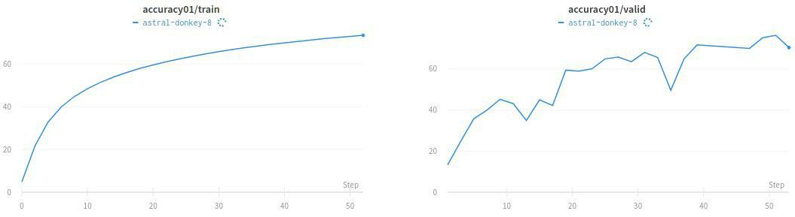

# README #

# Weights coming soon

This repo contains a Pytorch implementation of the paper,     
[Utterance-level Aggregation For Speaker Recognition In The Wild (Xie et al., ICASSP 2019) (Oral)](https://arxiv.org/pdf/1902.10107.pdf).

**New challenge on speaker recognition:
[The VoxCeleb Speaker Recognition Challenge (VoxSRC)](http://www.robots.ox.ac.uk/~vgg/data/voxceleb/competition.html).

### Dependencies
- [Python 3.6.0](https://www.continuum.io/downloads)
- [PyTorch 1.3.0](https://pytorch.org/)
- [Catalyst 19.11](https://github.com/catalyst-team/catalyst)

### Data
The dataset used for the experiments are

- [Voxceleb1, Voxceleb2](http://www.robots.ox.ac.uk/~vgg/data/voxceleb/)

